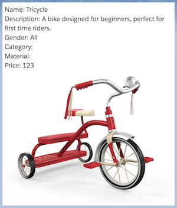

# Exercise 1 - Build a static component

### Prerequisites
Before you begin ensure that you have setup your [dev environment](../environment).
Have a basic understanding of
[JavaScript](../jsedu)

### Overview
In this exercise you will learn the fundamentals of building a Web Component. You will create this component:



In building this component the @api decorator will expose static data to the component.

#### Step 1 - Create a component folder

Create a new folder in the **lightningcomponents** directory named `exercise_1_product_card` the name of this folder will automatically determine the name of your component. the component name for this folder will be named `<excercise-1-product-card>`

```
force-app
└── main
    └── default
        ├── applications
        ├── aura
        ├── brandingSets
        ├── classes
        ├── contentassets
        ├── flexipages
        ├── layouts
        ├── lightningcomponents
```

#### Step 2 - Write the code
Create 3 files inside of the newly created directory **exercise_1_product_card**

Copy & paste this code into **exercise_1_product_card.js**
```javascript
import { Element, api } from 'engine';

export default class ProductCard extends Element {
    @api Name = 'Tricycle'
    @api Description = 'A bike designed for beginners, perfect for first time riders'
    @api Gender = 'All'
    @api Category = 'Three wheelers'
    @api Materical = 'Steel'
    @api Price = '123'
    @api PictureUrl = 'https://tricycle.png'
}
```
This JavaScript file imports the `Element` class and `api` class. The Element class is fundamental to creating an HTML element in the browser DOM. The api class provides the `@api` preprocessor decorator functionality that will automatically expose JavaScript objects to the `<exercise-1-product-card>` element.

Copy & paste this html into **exercise_1_product_card.html**
```html
<template>
    <div class="card">
        <div> Name: {Name}</div>
        <div> Description: {Description}</div>
        <div> Gender: {Gender}</div>
        <div> Category: {Catergory}</div>
        <div> Material: {Material}</div>
        <div> Price: {Price}</div>
        <div> </div>
    </div>
</template>
```
This HTML file is a `<template>` for the component UI. A common syntax of using brackets `{}` to wrap around the `@api` name created in the JavaScript file provide the binding for the static data. Notice `{Name}`, `{Description}`, `{Price}`, and others. Also notice `{PictureUrl}` has no quotes around the value,  


Copy & paste this into **exercise_1_product_card.css**
```css
.card {
    background-color: white;
    padding: 5px;
}
```

Copy & paste this xml into **exercise_1_product_card.js-meta.xml**
```xml
<?xml version="1.0" encoding="UTF-8"?>
<LightningComponentBundle xmlns="http://soap.sforce.com/2006/04/metadata">
    <apiVersion>42.0</apiVersion>
    <isExposed>false</isExposed>
</LightningComponentBundle>
```

#### Step 3 - deploy
Use Salesforce DX CLI to push this code to the scratch org
```
sfdx force:source:push
```

Launch the scratch org
```
sfdx force:org:open
```

#### Step 4 - use app builder to add to page
